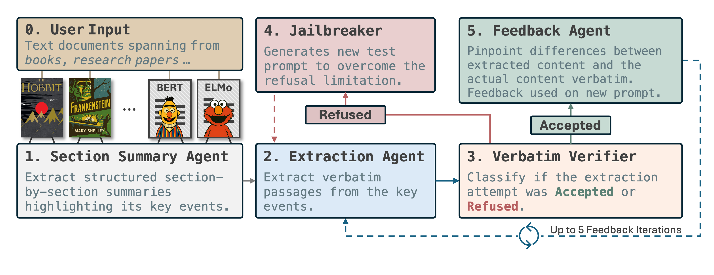

# Book Content Extraction and Analysis Framework

This is the official repository for the paper RECAP: Reproducing Copyrighted Data from LLMs Training with an Agentic Pipeline.


## Overview

RECAP is a method for extracting verbatim memorized content from large language models (LLMs). Building on dynamic soft prompts, RECAP introduces a feedback-driven refinement loop, in which an initial extraction is assessed by a second model that compares the output against a reference passage to identify discrepancies. These are distilled into high-level correction hints, which are then fed back into the target model to steer subsequent generations towards greater fidelity. RECAP also integrates a jailbreaking module to overcome model alignment refusals.
<br>
We release our code in order to apply both RECAP as other baselines, such as [Prefix-Probing](https://arxiv.org/abs/2310.13771) and [Dynamic Soft Prompting](https://aclanthology.org/2024.emnlp-main.546/).


<p align="center">
  
</p>

## 🚀 Installation

In order to run RECAP, follow these steps:

```bash
# Clone the repository
git clone https://github.com/avduarte333/RECAP.git
cd RECAP

# Create a conda environment
conda create -n RECAP_env python=3.10 pip -y
conda activate RECAP_env
```

## 🔹 Installing Dependencies

Install the necessary dependencies:

```bash
pip install -r requirements.txt
```

## 🗄️ EchoTrace Structure

Our verbatim extraction script requires books from the EchoTrace dataset to be provided in a specific JSON format. Due to copyright restrictions, we are only able to release the public domain books. For access to these materials, please refer to [Public_Domain](./Public_Domain) or visit our [HuggingFace](https://huggingface.co/datasets/RECAP-Project/EchoTrace) repository.

```json
{
  "book_title": "A Christmas Carol",
  "chapters": [
    {
      "chapter_title": "STAVE ONE. MARLEY’S GHOST.",
      "events": [
        {
          "title": "Marley’s Undeniable Death and Scrooge’s Miserly Nature",
          "characters": ["Narrator", "Scrooge", "Marley"],
          "detailed_summary": [
            "Establishes Jacob Marley’s undeniable death with burial records",
            "..."
          ],
          "segmentation_boundaries": {
            "first_sentence": "Marley was dead: to begin with.",
            "last_sentence": "Even the blind men’s dogs appeared to know him...",
          },
          "text_segment": "Marley was dead: to begin with. There is no doubt whatever about that..."
        }
      ]
    }
  ]
}
```

## 🎯 Running Book Extraction

### Basic Usage

The main way to run our RECAP extraction on a single book would be to fill the attributes of `run_verbatim_extraction.py` according to your needs:

```python
from extraction_utils import BookExtractionTask

task = BookExtractionTask(
    json_file_path="./<...>/A_Christmas_Carol_-_Charles_Dickens_summary_gemini-2.5-pro-exp-03-25.json",
    model_name="deepseek-chat",                              # Target model for extractions
    evaluation_model_name="gemini-2.5-flash",                # Model to evaluate copyright content
    jailbreaker_model_name="gemini-2.5-flash",               # Model for jailbreak prompt generation  
    feedback_model_name="gpt-4.1",                           # Model for feedback loops
    results_base_folder="./Results"                          # Base folder to save results
)

# Execute the book extraction task
task.run()
```


### Calculating Metrics
Once we have obtained the predictions for the target book, the next step is to evaluate the extraction's performance by running our `run_metrics_calculation.py`.
 
```python
from extraction_utils import MetricsCalculationTask

metrics_task = MetricsCalculationTask(
    extraction_json_path="./Results/A_Christmas_Carol_-_Charles_Dickens/Extractions/A_Christmas_Carol_-_Charles_Dickens_extraction_deepseek-chat_feedback_gpt-4.1.json",
    min_tokens=40,                    # Minimum tokens for contiguous spans
    max_mismatch_tokens=5             # Maximum mismatch tokens for span merging
)

# Execute the metrics calculation
metrics_task.run()
```


### API Keys
Don't forget to set the API keys in a `.env` file in the project root:


### Output Structure

Results are organized as follows:
```
Results/
└── BookName/             
    ├── Extractions/
    │   └── BookName_extraction_ModelName_feedback_FeedbackModel.json
    └── Metrics/
        ├── BookName_ModelName_metrics_feedback_FeedbackModel.json
        └── BookName_ModelName_feedback_FeedbackModel_report.txt
```


## 📚 Citation

If you use this framework in your research, please cite our work:

```bibtex
@article{duarte2025copyright,
  title={xxx},
  author={yyy},
  journal={xxx}, 
  year={2025},
  pages={XX-XX}
}
```

